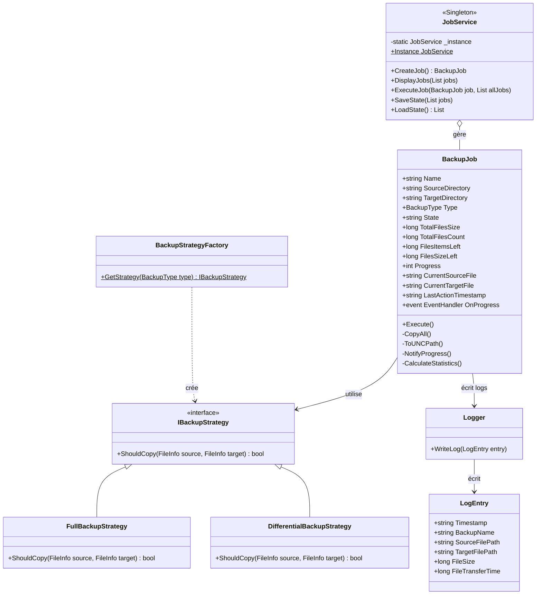
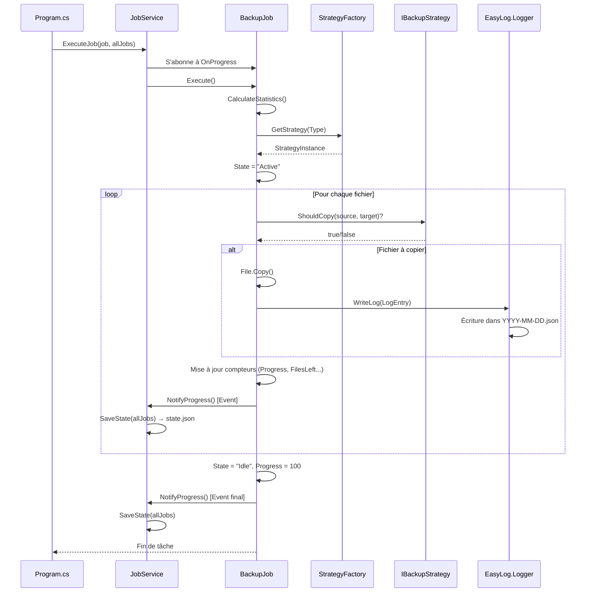

# EasySave - Logiciel de Sauvegarde

Application professionnelle de sauvegarde développée en .NET 8.0 avec interface graphique moderne (WebView2).

## 📋 Table des matières

- [Vue d'ensemble](#vue-densemble)
- [Versions](#versions)
- [Architecture du projet](#architecture-du-projet)
- [Fonctionnalités](#fonctionnalités)
- [Installation](#installation)
- [Utilisation](#utilisation)
- [Roadmap](#roadmap)

---

## 🎯 Vue d'ensemble

EasySave est une solution de sauvegarde professionnelle permettant de créer et d'exécuter des travaux de sauvegarde (complète ou différentielle) vers des destinations locales, externes ou réseau. L'application génère des fichiers de logs et un fichier d'état temps réel au format JSON.

---

## 📦 Versions

### Version 2.0 (En cours de développement) 🚧

**Interface Graphique**
- ✅ Interface moderne avec WebView2 (HTML/CSS/JavaScript)
- ✅ Design responsive avec dégradé violet/bleu
- ✅ Formulaire de création de tâches intuitif
- ✅ Liste des tâches avec cartes visuelles

**Fonctionnalités principales**
- ✅ Nombre de travaux illimité (vs 5 en v1.0)
- ✅ Sauvegarde complète et différentielle
- ✅ Logs journaliers au format JSON
- ✅ Fichier d'état temps réel
- ✅ Multi-langues (Français/Anglais)
- ✅ **Boutons Play/Pause/Resume/Stop fonctionnels**
- ✅ **React + TypeScript + Vite pour l'interface**
- ✅ **shadcn/ui + Tailwind CSS pour le design moderne**
- ✅ **Relance des jobs terminés**
- ⏳ Cryptage via CryptoSoft (à venir)
- ⏳ Détection logiciel métier (à venir)
- ⏳ Temps de cryptage dans les logs (à venir)

### Version 1.1 (Planifiée)

- ⏳ Support format XML pour les logs (en plus de JSON)
- ⏳ Choix du format dans les paramètres

### Version 1.0 (Base actuelle)

- ✅ Interface en ligne de commande
- ✅ Jusqu'à 5 travaux de sauvegarde
- ✅ Logs JSON uniquement
- ✅ Sauvegarde mono ou séquentielle

---

## 🏗️ Architecture du projet

L'application suit une architecture **3-tiers** modulaire et maintenable.

### Structure du projet

Le projet est divisé en **3 assemblies** :

#### 1. **EasyLog.dll** - Bibliothèque de journalisation
```
EasyLog/
├── Logger.cs        # Gestion de l'écriture des logs journaliers
└── LogEntry.cs      # Modèle d'entrée de log
```

#### 2. **EasySaveApp.dll** - Logique métier
```
EasySaveApp/
├── Models/
│   ├── BackupJob.cs      # Modèle de travail de sauvegarde
│   └── BackupType.cs     # Énumération (Full/Differential)
├── Services/
│   └── JobService.cs     # Gestion des travaux (CRUD + Execute)
├── Strategies/
│   ├── IBackupStrategy.cs              # Interface Strategy Pattern
│   ├── FullBackupStrategy.cs           # Stratégie complète
│   ├── DifferentialBackupStrategy.cs   # Stratégie différentielle
│   └── BackupStrategyFactory.cs        # Factory Pattern
├── Resources/
│   ├── Messages.resx     # Traductions françaises
│   └── Messages.fr.resx  # Traductions anglaises
└── Program.cs            # Point d'entrée CLI (v1.0)
```

#### 3. **EasySaveGUI.exe** - Interface graphique (v2.0)
```
EasySaveGUI/
├── Form1.cs              # Fenêtre principale WinForms + Bridge C#/JS
├── ui/                   # Projet React + TypeScript + Vite
│   ├── src/
│   │   ├── App.tsx                 # Composant principal React
│   │   ├── components/
│   │   │   ├── JobCard.tsx         # Carte de job avec boutons Play/Pause/Resume/Cancel
│   │   │   ├── AddJobForm.tsx      # Formulaire de création de job
│   │   │   └── ui/                 # Composants shadcn/ui (Card, Button, Progress, Badge, Input)
│   │   └── types/
│   │       └── bridge.ts           # Types TypeScript pour le bridge C#/JS
│   ├── package.json      # Dépendances npm (React, Vite, Tailwind, shadcn/ui)
│   ├── vite.config.ts    # Configuration Vite
│   └── tailwind.config.js # Configuration Tailwind CSS
├── wwwroot/              # Sortie Vite (dist/) copiée par MSBuild
│   └── index.html        # Interface compilée chargée par WebView2
└── EasySaveGUI.csproj    # Projet WinForms + WebView2 + PreBuildEvent React
```

### Technologies utilisées

- **.NET 8.0** - Framework principal
- **C# 12** - Langage backend
- **WinForms** - Conteneur de fenêtre
- **WebView2** - Moteur de rendu Chromium embarqué
- **React 18.3.1** - Framework UI frontend
- **TypeScript 5.6.3** - Typage statique JavaScript
- **Vite 6.0.3** - Bundler et dev server ultra-rapide
- **Tailwind CSS 3.4.17** - Framework CSS utility-first
- **shadcn/ui** - Bibliothèque de composants avec Radix UI
- **lucide-react 0.460.0** - Icônes modernes
- **Strategy Pattern** - Gestion des types de sauvegarde
- **Factory Pattern** - Création des stratégies
- **Singleton Pattern** - JobService unique
- **Observer Pattern** - Événements OnProgress
- **Bridge Pattern** - Communication C# ↔ JavaScript via COM

---

## ✨ Fonctionnalités

### ✅ Implémentées (v2.0)

1. **Interface Graphique Moderne**
   - Interface HTML/CSS responsive
   - Communication JavaScript ↔ C# via WebView2
   - Design violet/bleu professionnel

2. **Gestion des Travaux**
   - Création illimitée de travaux
   - Types : Complète / Différentielle
   - Affichage en temps réel (actualisation 500ms)
   - Barres de progression visuelles

3. **Système de Logs**
   - Logs journaliers JSON (format UNC)
   - Fichier d'état temps réel (state.json)
   - DLL réutilisable (EasyLog)

4. **Multi-langues**
   - Français / Anglais
   - Fichiers .resx

5. **Mode CLI**
   - EasySaveApp conserve l'interface console v1.0
   - Compatible scripts et automatisation

### 🔄 En développement

_Aucune fonctionnalité en développement actuellement_

### ⏳ Roadmap v2.0

1. **Cryptage CryptoSoft**
   - Appel au logiciel CryptoSoft.exe
   - Cryptage sélectif par extension (.docx, .pdf, etc.)
   - Paramètres utilisateur pour extensions à crypter

2. **Temps de cryptage**
   - Ajout dans LogEntry : `EncryptionTime` (ms)
   - 0 = pas de cryptage
   - >0 = temps en ms
   - <0 = code erreur

3. **Détection logiciel métier**
   - Bloquer sauvegarde si processus spécifique détecté
   - Paramètre : nom du processus (ex: calc.exe)
   - Log de l'arrêt

### ⏳ Roadmap v1.1

1. **Format XML**
   - Support logs XML en plus de JSON
   - Choix utilisateur dans les paramètres

---
**Responsabilités :**
- Écriture des logs journaliers au format JSON
- Un fichier par jour (`YYYY-MM-DD.json`)
- Format UNC pour les chemins de fichiers
- Conçu pour être réutilisé dans d'autres projets

#### 2. **EasySaveApp.exe** - Application Console principale
```
EasySaveApp/
├── Program.cs                    # Point d'entrée et interface Console
├── Models/
│   ├── BackupJob.cs             # Modèle de travail de sauvegarde
│   └── BackupType.cs            # Enum (Full/Differential)
├── Services/
│   └── JobService.cs            # Singleton - Gestion des jobs et persistance
├── Strategies/
│   ├── IBackupStrategy.cs       # Interface Strategy
│   ├── FullBackupStrategy.cs    # Stratégie de sauvegarde complète
│   ├── DifferentialBackupStrategy.cs  # Stratégie différentielle
│   └── BackupStrategyFactory.cs # Factory pour créer les stratégies
└── Resources/
    ├── Messages.resx            # Ressources EN
    └── Messages.fr.resx         # Ressources FR
```

### Diagramme de classes (UML)



---

## 🎨 Design Patterns

L'architecture d'EasySave utilise **7 design patterns** reconnus pour garantir maintenabilité, extensibilité et testabilité.

---

### 1. **Strategy Pattern** (Patron de Comportement) 🎯

**Localisation :** `EasySaveApp/Strategies/`

**Fichiers concernés :**
- `IBackupStrategy.cs` - Interface définissant le contrat
- `FullBackupStrategy.cs` - Implémentation sauvegarde complète
- `DifferentialBackupStrategy.cs` - Implémentation sauvegarde différentielle

**Rôle :** Encapsuler les algorithmes de décision de copie de fichiers. Le `BackupJob` ne sait pas *comment* décider s'il doit copier un fichier, il délègue cette responsabilité à une stratégie interchangeable.

**Avantages :**
- **Open/Closed Principle** : Ajouter un nouveau type de backup (incrémental, compressé) sans modifier le code existant
- **Testabilité** : Chaque stratégie peut être testée indépendamment
- **Flexibilité** : Changement de stratégie à l'exécution

**Code exemple :**
```csharp
// Sauvegarde complète : copie tous les fichiers
public class FullBackupStrategy : IBackupStrategy
{
    public bool ShouldCopy(FileInfo source, FileInfo target) => true;
}

// Sauvegarde différentielle : copie uniquement les fichiers modifiés
public class DifferentialBackupStrategy : IBackupStrategy
{
    public bool ShouldCopy(FileInfo source, FileInfo target) 
        => !target.Exists || source.LastWriteTime > target.LastWriteTime;
}
```

**Utilisation dans BackupJob :**
```csharp
var strategy = BackupStrategyFactory.GetStrategy(Type);
if (strategy.ShouldCopy(sourceFile, targetFile))
{
    File.Copy(sourceFile.FullName, targetFile.FullName, true);
}
```

---

### 2. **Factory Pattern** (Patron de Création) 🏭

**Localisation :** `EasySaveApp/Strategies/BackupStrategyFactory.cs`

**Rôle :** Centraliser la logique de création des objets `IBackupStrategy`. Le client demande une stratégie via un enum `BackupType` et la fabrique retourne l'instance appropriée.

**Avantages :**
- **Encapsulation** : Logique de création isolée
- **Simplicité** : Le client n'a pas besoin de connaître les classes concrètes
- **Maintenabilité** : Ajout d'un nouveau type dans un seul endroit

**Code :**
```csharp
public static class BackupStrategyFactory
{
    public static IBackupStrategy GetStrategy(BackupType type)
    {
        return type switch
        {
            BackupType.Full => new FullBackupStrategy(),
            BackupType.Differential => new DifferentialBackupStrategy(),
            _ => throw new ArgumentException($"Unknown backup type: {type}")
        };
    }
}
```

---

### 3. **Singleton Pattern** (Patron de Création) 🔒

**Localisation :** `EasySaveApp/Services/JobService.cs`

**Rôle :** Garantir qu'il existe une seule instance du service gérant les fichiers JSON (`state.json`). Évite les conflits d'accès concurrents et centralise la gestion des jobs.

**Avantages :**
- **Cohérence** : Un seul point d'accès aux données
- **Performance** : Instance unique, pas de recréation
- **Thread-safety** : Contrôle de l'accès concurrent aux fichiers

**Code :**
```csharp
public class JobService
{
    private static JobService? _instance;
    private static readonly object _lock = new();

    public static JobService Instance
    {
        get
        {
            if (_instance == null)
            {
                lock (_lock)
                {
                    _instance ??= new JobService();
                }
            }
            return _instance;
        }
    }

    private JobService() { } // Constructeur privé
}
```

---

### 4. **Observer Pattern** (Patron de Comportement) 👁️

**Localisation :** `EasySaveApp/Models/BackupJob.cs` + `EasySaveApp/Services/JobService.cs`

**Rôle :** Découpler le moteur de sauvegarde (`BackupJob`) du système de persistance (`JobService`). Le job notifie ses changements d'état via un événement, et les observateurs (JobService, GUI) réagissent automatiquement.

**Avantages :**
- **Couplage faible** : BackupJob ne connaît pas ses observateurs
- **Extensibilité** : Ajouter facilement de nouveaux observateurs (UI, logs, notifications)
- **Temps réel** : Mise à jour instantanée du `state.json`

**Code :**
```csharp
// BackupJob.cs - Publisher
public event EventHandler? OnProgress;

private void NotifyProgress()
{
    OnProgress?.Invoke(this, EventArgs.Empty);
}

// JobService.cs - Subscriber
job.OnProgress += (sender, e) =>
{
    SaveState(allJobs); // Mise à jour automatique du state.json
};
```

**Flux de données :**
```
BackupJob copie un fichier
   ↓
NotifyProgress() déclenche OnProgress
   ↓
JobService.SaveState() écrit dans state.json
   ↓
React App (useEffect polling 500ms) affiche la progression
```

---

### 5. **Bridge Pattern** (Patron Structurel) 🌉

**Localisation :** `EasySaveGUI/Form1.cs` (classe `Bridge`)

**Rôle :** Séparer l'abstraction (interface JavaScript) de l'implémentation (logique C#). Permet à React de communiquer avec le backend .NET via WebView2 sans couplage fort.

**Avantages :**
- **Indépendance** : Frontend et backend évoluent indépendamment
- **Réutilisabilité** : Le backend peut être utilisé avec d'autres UI (CLI, WPF, Blazor)
- **Testabilité** : Tester le backend sans UI

**Code C# (Bridge) :**
```csharp
[ComVisible(true)]
public class Bridge
{
    public string GetJobs()
    {
        var jobs = JobService.Instance.LoadState();
        return JsonSerializer.Serialize(jobs);
    }

    public void ExecuteJob(string name)
    {
        // Logique d'exécution...
    }
}

// Exposition à JavaScript
webView.CoreWebView2.AddHostObjectToScript("bridge", new Bridge());
```

**Code TypeScript (Client) :**
```typescript
// Appel depuis React
const jobs = JSON.parse(window.chrome.webview.hostObjects.bridge.GetJobs());
window.chrome.webview.hostObjects.bridge.ExecuteJob("test2");
```

---

### 6. **Repository Pattern** (Patron Architectural) 💾

**Localisation :** `EasySaveApp/Services/JobService.cs`

**Rôle :** Abstraire l'accès aux données (fichier JSON `state.json`). Encapsule la logique de sérialisation/désérialisation et fournit une interface CRUD claire.

**Avantages :**
- **Séparation des préoccupations** : Logique métier vs persistance
- **Testabilité** : Mock du repository pour tests unitaires
- **Flexibilité** : Changement de stockage (JSON → SQL, XML) sans impact sur le code métier

**Méthodes exposées :**
```csharp
public class JobService
{
    // CREATE
    public BackupJob CreateJob(string name, string source, string target, BackupType type);

    // READ
    public List<BackupJob> LoadState();

    // UPDATE (via SaveState après modification)
    public void SaveState(List<BackupJob> jobs);

    // DELETE (implicite via SaveState avec liste filtrée)
}
```

---

### 7. **Facade Pattern** (Patron Structurel) 🎭

**Localisation :** `EasySaveGUI/Form1.cs` (classe `Bridge`)

**Rôle :** Simplifier l'interface complexe du backend pour le frontend. La classe `Bridge` expose des méthodes simples (GetJobs, AddJob, ExecuteJob) qui orchestrent plusieurs classes du backend.

**Avantages :**
- **Simplicité** : L'UI n'a besoin de connaître qu'une seule classe
- **Réduction de la complexité** : Cache les détails d'implémentation (Strategy, Factory, Singleton)
- **Maintenance** : Changements internes sans impact sur l'UI

**Code :**
```csharp
public class Bridge // Facade
{
    public void ExecuteJob(string name)
    {
        // Simplifie l'appel complexe :
        // 1. LoadState() → Singleton
        // 2. Find job par nom
        // 3. ExecuteJob() → Strategy + Factory + Observer
        // 4. SaveState() → Repository
        
        var jobs = JobService.Instance.LoadState();
        var job = jobs.FirstOrDefault(j => j.Name == name);
        if (job != null)
        {
            JobService.Instance.ExecuteJob(job, jobs);
        }
    }
}
```

**Sans Facade (complexe pour l'UI) :**
```typescript
// ❌ L'UI devrait connaître JobService, LoadState, ExecuteJob, Observer...
const jobService = getJobService();
const jobs = jobService.loadState();
const job = jobs.find(j => j.name === "test2");
job.onProgress.subscribe(...);
jobService.executeJob(job, jobs);
```

**Avec Facade (simple) :**
```typescript
// ✅ Une seule ligne
bridge.ExecuteJob("test2");
```

---

### 📊 Résumé des Design Patterns

| Pattern | Type | Fichier(s) | Rôle | Principe SOLID |
|---------|------|------------|------|----------------|
| **Strategy** | Comportement | `IBackupStrategy.cs`, `FullBackupStrategy.cs`, `DifferentialBackupStrategy.cs` | Algorithmes de copie interchangeables | Open/Closed |
| **Factory** | Création | `BackupStrategyFactory.cs` | Création centralisée des stratégies | Single Responsibility |
| **Singleton** | Création | `JobService.cs` | Instance unique du service de gestion | - |
| **Observer** | Comportement | `BackupJob.cs` (OnProgress) | Notification temps réel des changements | Dependency Inversion |
| **Bridge** | Structurel | `Form1.cs` (Bridge class) | Séparation abstraction C#/JS | Dependency Inversion |
| **Repository** | Architectural | `JobService.cs` | Abstraction de la persistance JSON | Single Responsibility |
| **Facade** | Structurel | `Form1.cs` (Bridge class) | Interface simplifiée pour l'UI | Interface Segregation |

---

### 🎓 Principes SOLID appliqués

1. **Single Responsibility Principle (SRP)** ✅
   - `Logger` : Uniquement écriture de logs
   - `JobService` : Uniquement gestion de jobs
   - `BackupJob` : Uniquement logique de sauvegarde

2. **Open/Closed Principle (OCP)** ✅
   - Ajout d'un nouveau type de backup sans modifier `BackupJob`
   - Extension via `IBackupStrategy`

3. **Liskov Substitution Principle (LSP)** ✅
   - Toutes les implémentations de `IBackupStrategy` sont substituables

4. **Interface Segregation Principle (ISP)** ✅
   - `IBackupStrategy` : Interface minimale (1 méthode)
   - `Bridge` : Méthodes spécifiques à l'UI

5. **Dependency Inversion Principle (DIP)** ✅
   - `BackupJob` dépend de `IBackupStrategy` (abstraction), pas des classes concrètes
   - `Observer` permet à `BackupJob` de ne pas connaître `JobService`

---

## 🚀 Installation

### Prérequis

- .NET 8.0 SDK ([Télécharger](https://dotnet.microsoft.com/download/dotnet/8.0))
- Windows 10/11 (pour WebView2)
- WebView2 Runtime (généralement préinstallé sur Windows 11)

### Compilation depuis les sources

```powershell
# Cloner le projet
git clone https://github.com/votre-repo/EasySave.git
cd EasySave

# Compiler tous les projets (React + .NET)
dotnet build EasySaveGUI/EasySaveGUI.csproj

# Lancer l'interface graphique (v2.0)
.\EasySaveGUI\bin\Debug\net8.0-windows\EasySaveGUI.exe

# OU lancer la CLI (v1.0 - compatible)
cd EasySaveApp
dotnet run
```

### Exécuter directement

```powershell
# Depuis la racine du projet
.\EasySaveGUI\bin\Debug\net8.0-windows\EasySaveGUI.exe

# OU avec chemin complet
cd "C:\Users\<user>\Documents\cesi\genie_logiciel\projet\EasySave"
.\EasySaveGUI\bin\Debug\net8.0-windows\EasySaveGUI.exe
```

### Rebuild et relance rapide

```powershell
# Tuer l'instance en cours + recompiler + relancer
Get-Process | Where-Object { $_.ProcessName -like "*EasySave*" } | Stop-Process -Force -ErrorAction SilentlyContinue; Start-Sleep -Milliseconds 500; dotnet build EasySaveGUI/EasySaveGUI.csproj; cd EasySaveGUI/bin/Debug/net8.0-windows; .\EasySaveGUI.exe
```

---

## 💻 Utilisation

### Interface Graphique (v2.0)

1. **Créer une tâche**
   - Remplir le formulaire en haut : Nom, Type (Complète/Différentielle), Source, Destination
   - Cliquer sur "Ajouter la tâche"

2. **Lancer une sauvegarde**
   - Cliquer sur le bouton **▶ Lancer** de la tâche
   - La progression s'affiche en temps réel (actualisation 500ms)
   - État : **Idle** → **Active** → **Completed**

3. **Contrôler l'exécution** ✅
   - **⏸ Pause** : Mettre en pause la sauvegarde en cours
   - **⏯ Reprendre** : Continuer après pause (État passe à **Paused** → **Active**)
   - **■ Annuler** : Arrêter définitivement (État → **Cancelled**)
   - **▶ Lancer** (sur job terminé) : Relancer une sauvegarde complétée/annulée

4. **États des jobs**
   - 🟢 **Idle** : En attente, prêt à lancer
   - 🔵 **Active** : Sauvegarde en cours
   - 🟡 **Paused** : En pause (peut reprendre)
   - ✅ **Completed** : Terminé avec succès
   - 🔴 **Cancelled** : Annulé par l'utilisateur

### Interface CLI (v1.0 - toujours disponible)

```powershell
cd EasySaveApp
dotnet run

# Menu interactif:
# 1 - Créer un nouveau travail
# 2 - Afficher tous les travaux
# 3 - Exécuter un travail
# 4 - Exécuter tous les travaux
# 5 - Quitter
```

### Fichiers générés

**Logs journaliers** (un par jour)
```
%APPDATA%\EasySave\logs\log_30-01-2026.json
```

**État en temps réel**
```
%APPDATA%\EasySave\state.json
```

Exemple `state.json`:
```json
[
  {
    "Name": "Sauvegarde Documents",
    "SourceDirectory": "C:\\Users\\Documents",
    "TargetDirectory": "D:\\Backups",
    "Type": 0,
    "State": "Active",
    "Progress": 45,
    "TotalFilesSize": 1048576000,
    "TotalFilesCount": 150,
    "FilesItemsLeft": 82,
    "CurrentSourceFile": "C:\\Users\\Documents\\rapport.docx"
  }
]
```

---

## 📊 Comparaison des versions

| Fonction | Version 1.0 | Version 1.1 | Version 2.0 |
|----------|-------------|-------------|-------------|
| Interface Graphique | Console | Console | ✅ Graphique (WebView2 + React) |
| Multi-langues | ✅ FR/EN | ✅ FR/EN | ✅ FR/EN |
| Travaux de sauvegarde | Limité à 5 | Limité à 5 | ✅ Illimité |
| Fichier Log journalier | ✅ JSON | ✅ JSON + XML | ✅ JSON (XML v1.1) |
| Temps de cryptage dans log | ❌ | ❌ | 🔄 (v2.0) |
| Utilisation DLL pour log | ✅ | ✅ | ✅ |
| Fichier État | ✅ | ✅ | ✅ |
| Type de sauvegarde | Mono/Séquentielle | Mono/Séquentielle | Mono/Séquentielle |
| Détection logiciel métier | ❌ | ❌ | 🔄 (v2.0) |
| Ligne de commande | ✅ | ✅ | ✅ (compatible) |
| Cryptage CryptoSoft | ❌ | ❌ | 🔄 (v2.0) |
| Boutons Play/Pause/Resume/Stop | ❌ | ❌ | ✅ Fonctionnel |
| Relance jobs terminés | ❌ | ❌ | ✅ Fonctionnel |
| Framework UI | - | - | React + TypeScript + shadcn/ui |

**Légende:** ✅ Implémenté | 🔄 En développement | ❌ Non disponible

---
cd EasySave

# Compiler la solution
dotnet build EasySave.slnx

# L'exécutable se trouve dans :
# EasySaveApp\bin\Debug\net8.0\EasySaveApp.exe
```

### Fichiers générés

Les fichiers de données sont stockés dans :
```
%APPDATA%\EasySave\
├── state.json           # État temps réel
└── Logs/
    ├── 2026-01-29.json # Logs journaliers
    ├── 2026-01-30.json
    └── ...
```

---

## 💻 Utilisation

### Mode Interactif

```powershell
cd EasySaveApp\bin\Debug\net8.0
.\EasySaveApp.exe
```

**Menu principal :**
```
Choose Language / Choisissez la langue (en/fr): fr

--- Menu EasySave ---
1. Créer un travail de sauvegarde
2. Lister les travaux
3. Exécuter les sauvegardes
4. Quitter
```

### Mode Ligne de Commande (CLI)

Pour automatiser les sauvegardes (scripts, tâches planifiées) :

#### Exécuter une plage de jobs
```powershell
.\EasySaveApp.exe 1-3
# Exécute les jobs 1, 2 et 3 séquentiellement
```

#### Exécuter des jobs spécifiques
```powershell
.\EasySaveApp.exe 1;3;5
# Exécute les jobs 1, 3 et 5
```

#### Exécuter un seul job
```powershell
.\EasySaveApp.exe 2
# Exécute uniquement le job 2
```

**Note :** En mode CLI, la langue par défaut est détectée automatiquement. Utilisez un pipe pour forcer :
```powershell
echo "fr" | .\EasySaveApp.exe 1-3
```

---

## 📄 Format des fichiers

### state.json (Fichier d'état temps réel)

Mis à jour en temps réel pendant l'exécution des sauvegardes.

```json
[
  {
    "Name": "BackupWeb",
    "SourceDirectory": "C:\\Sites\\Web",
    "TargetDirectory": "D:\\Backup\\Web",
    "Type": 0,
    "State": "Active",
    "TotalFilesSize": 104857600,
    "TotalFilesCount": 350,
    "FilesItemsLeft": 120,
    "FilesSizeLeft": 35651584,
    "Progress": 65,
    "CurrentSourceFile": "C:\\Sites\\Web\\images\\photo.jpg",
    "CurrentTargetFile": "D:\\Backup\\Web\\images\\photo.jpg",
    "LastActionTimestamp": "29/01/2026 19:30:45"
  },
  {
    "Name": "BackupDocs",
    "SourceDirectory": "C:\\Documents",
    "TargetDirectory": "\\\\NAS\\Backup\\Docs",
    "Type": 1,
    "State": "Idle",
    "TotalFilesSize": 52428800,
    "TotalFilesCount": 180,
    "FilesItemsLeft": 0,
    "FilesSizeLeft": 0,
    "Progress": 100,
    "CurrentSourceFile": "",
    "CurrentTargetFile": "",
    "LastActionTimestamp": "29/01/2026 18:45:12"
  }
]
```

**États possibles :**
- `Idle` : En attente
- `Active` : Sauvegarde en cours

**Types de sauvegarde :**
- `0` : Complète (Full)
- `1` : Différentielle (Differential)

### Log journalier (YYYY-MM-DD.json)

Un fichier par jour contenant toutes les actions de sauvegarde.

```json
[
  {
    "Timestamp": "29/01/2026 19:30:42",
    "BackupName": "BackupWeb",
    "SourceFilePath": "\\\\localhost\\C$\\Sites\\Web\\index.html",
    "TargetFilePath": "\\\\localhost\\D$\\Backup\\Web\\index.html",
    "FileSize": 4096,
    "FileTransferTime": 15
  },
  {
    "Timestamp": "29/01/2026 19:30:43",
    "BackupName": "BackupWeb",
    "SourceFilePath": "\\\\localhost\\C$\\Sites\\Web\\style.css",
    "TargetFilePath": "\\\\localhost\\D$\\Backup\\Web\\style.css",
    "FileSize": 2048,
    "FileTransferTime": 8
  },
  {
    "Timestamp": "29/01/2026 19:31:10",
    "BackupName": "BackupWeb",
    "SourceFilePath": "\\\\localhost\\C$\\Sites\\Web\\locked.db",
    "TargetFilePath": "\\\\localhost\\D$\\Backup\\Web\\locked.db",
    "FileSize": 8192,
    "FileTransferTime": -1
  }
]
```

**Champs :**
- `FileTransferTime` : Temps en millisecondes. **Négatif si erreur** (fichier verrouillé, accès refusé, etc.)
- Chemins au **format UNC** (`\\localhost\C$\...`) pour compatibilité serveur

---

## 📊 Diagramme de séquence : Exécution d'un Job



---

## ✅ Conformité aux exigences

| Exigence | Implémentation | Statut |
|----------|----------------|:------:|
| Application Console .NET | .NET 8.0 Console App | ✅ |
| Max 5 travaux de sauvegarde | Vérification dans `Program.cs` (case "1") | ✅ |
| Définition d'un travail | Modèle `BackupJob` avec toutes les propriétés | ✅ |
| Types de sauvegarde (Complète/Différentielle) | Pattern Strategy | ✅ |
| Support Anglais/Français | Fichiers `.resx` + `CultureInfo` | ✅ |
| Exécution d'un ou tous les travaux | Mode interactif (case "3") | ✅ |
| Exécution par ligne de commande | Parsing des `args[]` avec formats `1-3` et `1;3` | ✅ |
| Disques locaux/externes/réseau | Chemins absolus et UNC supportés | ✅ |
| Sauvegarde complète (fichiers + sous-répertoires) | `CopyAll()` récursif | ✅ |
| Log journalier temps réel | `EasyLog.dll` avec horodatage | ✅ |
| Informations minimales dans le log | Timestamp, nom, chemins UNC, taille, temps transfert | ✅ |
| DLL séparée EasyLog | Projet indépendant | ✅ |
| Fichier état temps réel | `state.json` avec Pattern Observer | ✅ |
| Informations état (nom, timestamp, état, progression) | Toutes les propriétés requises | ✅ |
| Emplacement fichiers compatible serveur | `%APPDATA%\EasySave\` | ✅ |
| Format JSON avec retours à la ligne | `WriteIndented = true` | ✅ |

---

## 🌍 Internationalisation (i18n)

### Implémentation

**Pattern :** Satellite Assembly (méthode standard .NET)

**Fichiers de ressources :**
- `Messages.resx` → Anglais (langue par défaut)
- `Messages.fr.resx` → Français

**Utilisation dans le code :**
```csharp
Console.WriteLine(EasySaveApp.Resources.Messages.MenuTitle);
```

**Sélection de la langue :**
```csharp
var culture = new CultureInfo(langChoice == "fr" ? "fr-FR" : "en-US");
CultureInfo.CurrentUICulture = culture;
CultureInfo.CurrentCulture = culture;
```

---

## ⚠️ Gestion des erreurs

### Stratégies de robustesse

| Scénario | Gestion | Comportement |
|----------|---------|--------------|
| Fichier verrouillé | `try-catch` + log | Temps de transfert = -1 dans le log |
| Répertoire cible inexistant | `Directory.CreateDirectory()` | Création automatique |
| Désérialisation JSON échouée | `catch` + liste vide | Retourne `new List<BackupJob>()` |
| Console redirigée (pipe) | `Console.IsInputRedirected` | Skip `ReadKey()` |
| Répertoire source inexistant | Vérification `Directory.Exists()` | Pas d'exécution |
| Job index invalide (CLI) | Vérification range | Message d'erreur explicite |

### Exemple de log d'erreur
```json
{
  "Timestamp": "29/01/2026 19:31:10",
  "BackupName": "BackupDB",
  "SourceFilePath": "\\\\localhost\\C$\\Database\\data.mdf",
  "TargetFilePath": "\\\\localhost\\D$\\Backup\\data.mdf",
  "FileSize": 10485760,
  "FileTransferTime": -1  // ⚠️ Erreur : fichier verrouillé par SQL Server
}
```

---

## 🚧 Limitations de la V1.0

- **Maximum 5 travaux** de sauvegarde configurables
- **Exécution séquentielle** uniquement (pas de parallélisme)
- **Pas de reprise** après échec (un fichier échoué ne stoppe pas la sauvegarde)
- **Pas de compression** des fichiers
- **Pas d'exclusion** de fichiers/dossiers (pattern)
- **Pas de notification** en fin de sauvegarde
- **Interface Console** uniquement (pas d'UI graphique)
- **Logs sans rotation** automatique (un fichier par jour sans suppression automatique)

---

## 🔮 Évolutions futures (V2.0)

### Transition vers MVVM

L'architecture actuelle en couches facilite la migration vers **MVVM (Model-View-ViewModel)** :

```
Couche actuelle          →  MVVM V2.0
─────────────────────────────────────────
Program.cs (Console)     →  View (WPF/Avalonia)
JobService               →  ViewModel
BackupJob                →  Model (inchangé)
IBackupStrategy          →  Model (inchangé)
```

### Fonctionnalités envisagées

- 🖥️ Interface graphique (WPF + MVVM)
- ⏸️ Pause/Reprise des sauvegardes
- 🔄 Sauvegarde incrémentale
- 📦 Compression/Chiffrement
- 📧 Notifications (email, toast)
- 🎯 Exclusion de fichiers (patterns/regex)
- 📊 Dashboard de statistiques
- ⏰ Planification automatique (scheduler intégré)
- 🌐 Support MacOS/Linux (.NET Multi-platform)

---

## 📞 Support

Pour toute question ou problème :
- 📖 Consultez ce README
- 🐛 Vérifiez les logs dans `%APPDATA%\EasySave\Logs\`
- 📋 Vérifiez le `state.json` pour l'état des jobs

---

## 📜 Licence

Projet académique - CESI École d'Ingénieurs
© 2026 - Tous droits réservés

---

**Version :** 1.0  
**Date :** Janvier 2026  
**Framework :** .NET 8.0  
**Langage :** C# 12
