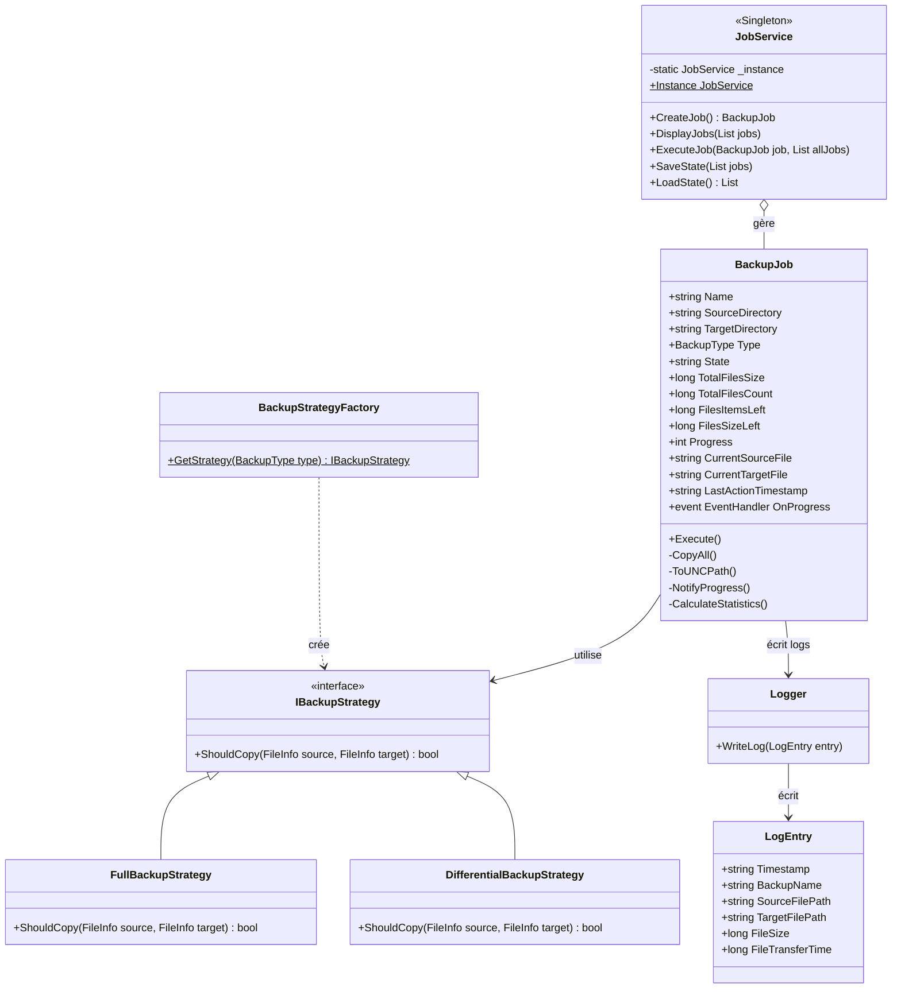
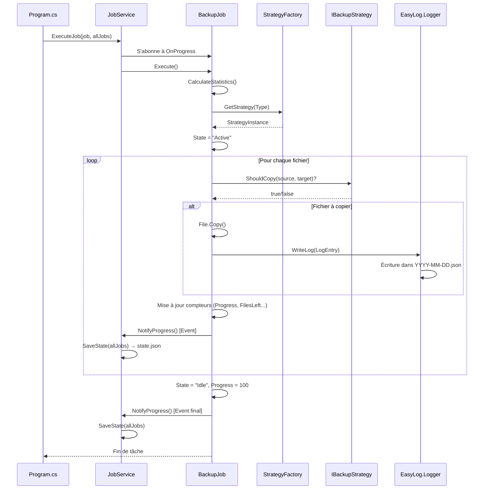

# EasySave - Logiciel de Sauvegarde

Application professionnelle de sauvegarde développée en .NET 8.0 avec interface graphique moderne (WebView2).

## 📋 Table des matières

- [Vue d'ensemble](#vue-densemble)
- [Versions](#versions)
- [Architecture du projet](#architecture-du-projet)
- [Fonctionnalités](#fonctionnalités)
- [Installation](#installation)
- [Utilisation](#utilisation)
- [Roadmap](#roadmap)

---

## 🎯 Vue d'ensemble

EasySave est une solution de sauvegarde professionnelle permettant de créer et d'exécuter des travaux de sauvegarde (complète ou différentielle) vers des destinations locales, externes ou réseau. L'application génère des fichiers de logs et un fichier d'état temps réel au format JSON.

---

## 📦 Versions

### Version 2.0 (En cours de développement) 🚧

**Interface Graphique**
- ✅ Interface moderne avec WebView2 (HTML/CSS/JavaScript)
- ✅ Design responsive avec dégradé violet/bleu
- ✅ Formulaire de création de tâches intuitif
- ✅ Liste des tâches avec cartes visuelles

**Fonctionnalités principales**
- ✅ Nombre de travaux illimité (vs 5 en v1.0)
- ✅ Sauvegarde complète et différentielle
- ✅ Logs journaliers au format JSON
- ✅ Fichier d'état temps réel
- ✅ Multi-langues (Français/Anglais)
- 🔄 Boutons Play/Pause/Stop (en développement)
- ⏳ Cryptage via CryptoSoft (à venir)
- ⏳ Détection logiciel métier (à venir)
- ⏳ Temps de cryptage dans les logs (à venir)

### Version 1.1 (Planifiée)

- ⏳ Support format XML pour les logs (en plus de JSON)
- ⏳ Choix du format dans les paramètres

### Version 1.0 (Base actuelle)

- ✅ Interface en ligne de commande
- ✅ Jusqu'à 5 travaux de sauvegarde
- ✅ Logs JSON uniquement
- ✅ Sauvegarde mono ou séquentielle

---

## 🏗️ Architecture du projet

L'application suit une architecture **3-tiers** modulaire et maintenable.

### Structure du projet

Le projet est divisé en **3 assemblies** :

#### 1. **EasyLog.dll** - Bibliothèque de journalisation
```
EasyLog/
├── Logger.cs        # Gestion de l'écriture des logs journaliers
└── LogEntry.cs      # Modèle d'entrée de log
```

#### 2. **EasySaveApp.dll** - Logique métier
```
EasySaveApp/
├── Models/
│   ├── BackupJob.cs      # Modèle de travail de sauvegarde
│   └── BackupType.cs     # Énumération (Full/Differential)
├── Services/
│   └── JobService.cs     # Gestion des travaux (CRUD + Execute)
├── Strategies/
│   ├── IBackupStrategy.cs              # Interface Strategy Pattern
│   ├── FullBackupStrategy.cs           # Stratégie complète
│   ├── DifferentialBackupStrategy.cs   # Stratégie différentielle
│   └── BackupStrategyFactory.cs        # Factory Pattern
├── Resources/
│   ├── Messages.resx     # Traductions françaises
│   └── Messages.fr.resx  # Traductions anglaises
└── Program.cs            # Point d'entrée CLI (v1.0)
```

#### 3. **EasySaveGUI.exe** - Interface graphique (v2.0)
```
EasySaveGUI/
├── Form1.cs              # Fenêtre principale WinForms
├── wwwroot/
│   └── index.html        # Interface WebView2 moderne
└── EasySaveGUI.csproj    # Projet WinForms + WebView2
```

### Technologies utilisées

- **.NET 8.0** - Framework principal
- **WinForms** - Conteneur de fenêtre
- **WebView2** - Moteur de rendu HTML/CSS/JavaScript
- **Strategy Pattern** - Gestion des types de sauvegarde
- **Factory Pattern** - Création des stratégies
- **Singleton Pattern** - JobService unique

---

## ✨ Fonctionnalités

### ✅ Implémentées (v2.0)

1. **Interface Graphique Moderne**
   - Interface HTML/CSS responsive
   - Communication JavaScript ↔ C# via WebView2
   - Design violet/bleu professionnel

2. **Gestion des Travaux**
   - Création illimitée de travaux
   - Types : Complète / Différentielle
   - Affichage en temps réel (actualisation 500ms)
   - Barres de progression visuelles

3. **Système de Logs**
   - Logs journaliers JSON (format UNC)
   - Fichier d'état temps réel (state.json)
   - DLL réutilisable (EasyLog)

4. **Multi-langues**
   - Français / Anglais
   - Fichiers .resx

5. **Mode CLI**
   - EasySaveApp conserve l'interface console v1.0
   - Compatible scripts et automatisation

### 🔄 En développement

1. **Contrôles d'exécution**
   - ▶ Play : Lancer une sauvegarde
   - ⏸ Pause : Mettre en pause
   - ⏯ Resume : Reprendre
   - ■ Stop : Annuler

### ⏳ Roadmap v2.0

1. **Cryptage CryptoSoft**
   - Appel au logiciel CryptoSoft.exe
   - Cryptage sélectif par extension (.docx, .pdf, etc.)
   - Paramètres utilisateur pour extensions à crypter

2. **Temps de cryptage**
   - Ajout dans LogEntry : `EncryptionTime` (ms)
   - 0 = pas de cryptage
   - >0 = temps en ms
   - <0 = code erreur

3. **Détection logiciel métier**
   - Bloquer sauvegarde si processus spécifique détecté
   - Paramètre : nom du processus (ex: calc.exe)
   - Log de l'arrêt

### ⏳ Roadmap v1.1

1. **Format XML**
   - Support logs XML en plus de JSON
   - Choix utilisateur dans les paramètres

---
**Responsabilités :**
- Écriture des logs journaliers au format JSON
- Un fichier par jour (`YYYY-MM-DD.json`)
- Format UNC pour les chemins de fichiers
- Conçu pour être réutilisé dans d'autres projets

#### 2. **EasySaveApp.exe** - Application Console principale
```
EasySaveApp/
├── Program.cs                    # Point d'entrée et interface Console
├── Models/
│   ├── BackupJob.cs             # Modèle de travail de sauvegarde
│   └── BackupType.cs            # Enum (Full/Differential)
├── Services/
│   └── JobService.cs            # Singleton - Gestion des jobs et persistance
├── Strategies/
│   ├── IBackupStrategy.cs       # Interface Strategy
│   ├── FullBackupStrategy.cs    # Stratégie de sauvegarde complète
│   ├── DifferentialBackupStrategy.cs  # Stratégie différentielle
│   └── BackupStrategyFactory.cs # Factory pour créer les stratégies
└── Resources/
    ├── Messages.resx            # Ressources EN
    └── Messages.fr.resx         # Ressources FR
```

### Diagramme de classes (UML)



---

## 🎨 Design Patterns

### 1. Singleton (Patron de Création)

**Classe :** `JobService`

**Justification :** Garantir qu'il n'existe qu'une seule instance du service gérant les fichiers (`state.json`). Cela évite les conflits d'accès concurrents et centralise la logique de chargement/sauvegarde.

```csharp
public static JobService Instance => _instance ??= new JobService();
```

### 2. Strategy (Patron de Comportement)

**Classes :** `IBackupStrategy`, `FullBackupStrategy`, `DifferentialBackupStrategy`

**Justification :** Isoler l'algorithme de décision de copie. Le `BackupJob` ne sait pas *comment* décider s'il doit copier un fichier ; il délègue cette tâche à une stratégie. Cela permet d'ajouter de nouveaux types de backup (ex: incrémental, compressé) sans modifier le code existant.

**Principe SOLID respecté :** Open/Closed Principle

```csharp
// Sauvegarde complète : copie tout
public bool ShouldCopy(FileInfo source, FileInfo target) => true;

// Sauvegarde différentielle : copie si modifié
public bool ShouldCopy(FileInfo source, FileInfo target) 
    => !target.Exists || source.LastWriteTime > target.LastWriteTime;
```

### 3. Factory (Patron de Création)

**Classe :** `BackupStrategyFactory`

**Justification :** Simplifier la création des stratégies. On passe un `BackupType` (Enum) et la fabrique retourne l'objet approprié.

```csharp
public static IBackupStrategy GetStrategy(BackupType type)
{
    return type switch
    {
        BackupType.Full => new FullBackupStrategy(),
        BackupType.Differential => new DifferentialBackupStrategy(),
        _ => throw new ArgumentException("Unknown backup type")
    };
}
```

### 4. Observer (Patron de Comportement)

**Implémentation :** Événement `OnProgress` dans `BackupJob`

**Justification :** Découpler totalement le moteur de sauvegarde du système de sauvegarde d'état. Le job "notifie" ses progrès, et le service (l'observateur) réagit en écrivant dans le JSON. C'est la base de la communication temps réel demandée.

```csharp
// BackupJob déclenche l'événement
OnProgress?.Invoke(this, new ProgressEventArgs { Job = this });

// JobService s'abonne
job.OnProgress += (sender, e) => { this.SaveState(allJobs); };
```

---

## 🚀 Installation

### Prérequis

- .NET 8.0 SDK ([Télécharger](https://dotnet.microsoft.com/download/dotnet/8.0))
- Windows 10/11 (pour WebView2)
- WebView2 Runtime (généralement préinstallé sur Windows 11)

### Compilation depuis les sources

```powershell
# Cloner le projet
git clone https://github.com/votre-repo/EasySave.git
cd EasySave

# Compiler tous les projets
dotnet build

# Lancer l'interface graphique (v2.0)
cd EasySaveGUI
dotnet run

# OU lancer la CLI (v1.0 - compatible)
cd EasySaveApp
dotnet run
```

### Exécuter directement

```powershell
# Après compilation, l'exécutable se trouve dans:
EasySaveGUI\bin\Debug\net8.0-windows\EasySaveGUI.exe
```

---

## 💻 Utilisation

### Interface Graphique (v2.0)

1. **Créer une tâche**
   - Remplir le formulaire en haut : Nom, Type, Source, Destination
   - Cliquer sur "Ajouter la tâche"

2. **Lancer une sauvegarde**
   - Cliquer sur le bouton ▶ **Lancer** de la tâche
   - La progression s'affiche en temps réel

3. **Contrôler l'exécution** (en développement)
   - ⏸ **Pause** : Mettre en pause
   - ⏯ **Reprendre** : Continuer après pause
   - ■ **Annuler** : Arrêter définitivement

### Interface CLI (v1.0 - toujours disponible)

```powershell
cd EasySaveApp
dotnet run

# Menu interactif:
# 1 - Créer un nouveau travail
# 2 - Afficher tous les travaux
# 3 - Exécuter un travail
# 4 - Exécuter tous les travaux
# 5 - Quitter
```

### Fichiers générés

**Logs journaliers** (un par jour)
```
%APPDATA%\EasySave\logs\log_30-01-2026.json
```

**État en temps réel**
```
%APPDATA%\EasySave\state.json
```

Exemple `state.json`:
```json
[
  {
    "Name": "Sauvegarde Documents",
    "SourceDirectory": "C:\\Users\\Documents",
    "TargetDirectory": "D:\\Backups",
    "Type": 0,
    "State": "Active",
    "Progress": 45,
    "TotalFilesSize": 1048576000,
    "TotalFilesCount": 150,
    "FilesItemsLeft": 82,
    "CurrentSourceFile": "C:\\Users\\Documents\\rapport.docx"
  }
]
```

---

## 📊 Comparaison des versions

| Fonction | Version 1.0 | Version 1.1 | Version 2.0 |
|----------|-------------|-------------|-------------|
| Interface Graphique | Console | Console | ✅ Graphique (WebView2) |
| Multi-langues | ✅ FR/EN | ✅ FR/EN | ✅ FR/EN |
| Travaux de sauvegarde | Limité à 5 | Limité à 5 | ✅ Illimité |
| Fichier Log journalier | ✅ JSON | ✅ JSON + XML | ✅ JSON (XML v1.1) |
| Temps de cryptage dans log | ❌ | ❌ | 🔄 (v2.0) |
| Utilisation DLL pour log | ✅ | ✅ | ✅ |
| Fichier État | ✅ | ✅ | ✅ |
| Type de sauvegarde | Mono/Séquentielle | Mono/Séquentielle | Mono/Séquentielle |
| Détection logiciel métier | ❌ | ❌ | 🔄 (v2.0) |
| Ligne de commande | ✅ | ✅ | ✅ (compatible) |
| Cryptage CryptoSoft | ❌ | ❌ | 🔄 (v2.0) |
| Boutons Play/Pause/Stop | ❌ | ❌ | 🔄 (v2.0) |

**Légende:** ✅ Implémenté | 🔄 En développement | ❌ Non disponible

---
cd EasySave

# Compiler la solution
dotnet build EasySave.slnx

# L'exécutable se trouve dans :
# EasySaveApp\bin\Debug\net8.0\EasySaveApp.exe
```

### Fichiers générés

Les fichiers de données sont stockés dans :
```
%APPDATA%\EasySave\
├── state.json           # État temps réel
└── Logs/
    ├── 2026-01-29.json # Logs journaliers
    ├── 2026-01-30.json
    └── ...
```

---

## 💻 Utilisation

### Mode Interactif

```powershell
cd EasySaveApp\bin\Debug\net8.0
.\EasySaveApp.exe
```

**Menu principal :**
```
Choose Language / Choisissez la langue (en/fr): fr

--- Menu EasySave ---
1. Créer un travail de sauvegarde
2. Lister les travaux
3. Exécuter les sauvegardes
4. Quitter
```

### Mode Ligne de Commande (CLI)

Pour automatiser les sauvegardes (scripts, tâches planifiées) :

#### Exécuter une plage de jobs
```powershell
.\EasySaveApp.exe 1-3
# Exécute les jobs 1, 2 et 3 séquentiellement
```

#### Exécuter des jobs spécifiques
```powershell
.\EasySaveApp.exe 1;3;5
# Exécute les jobs 1, 3 et 5
```

#### Exécuter un seul job
```powershell
.\EasySaveApp.exe 2
# Exécute uniquement le job 2
```

**Note :** En mode CLI, la langue par défaut est détectée automatiquement. Utilisez un pipe pour forcer :
```powershell
echo "fr" | .\EasySaveApp.exe 1-3
```

---

## 📄 Format des fichiers

### state.json (Fichier d'état temps réel)

Mis à jour en temps réel pendant l'exécution des sauvegardes.

```json
[
  {
    "Name": "BackupWeb",
    "SourceDirectory": "C:\\Sites\\Web",
    "TargetDirectory": "D:\\Backup\\Web",
    "Type": 0,
    "State": "Active",
    "TotalFilesSize": 104857600,
    "TotalFilesCount": 350,
    "FilesItemsLeft": 120,
    "FilesSizeLeft": 35651584,
    "Progress": 65,
    "CurrentSourceFile": "C:\\Sites\\Web\\images\\photo.jpg",
    "CurrentTargetFile": "D:\\Backup\\Web\\images\\photo.jpg",
    "LastActionTimestamp": "29/01/2026 19:30:45"
  },
  {
    "Name": "BackupDocs",
    "SourceDirectory": "C:\\Documents",
    "TargetDirectory": "\\\\NAS\\Backup\\Docs",
    "Type": 1,
    "State": "Idle",
    "TotalFilesSize": 52428800,
    "TotalFilesCount": 180,
    "FilesItemsLeft": 0,
    "FilesSizeLeft": 0,
    "Progress": 100,
    "CurrentSourceFile": "",
    "CurrentTargetFile": "",
    "LastActionTimestamp": "29/01/2026 18:45:12"
  }
]
```

**États possibles :**
- `Idle` : En attente
- `Active` : Sauvegarde en cours

**Types de sauvegarde :**
- `0` : Complète (Full)
- `1` : Différentielle (Differential)

### Log journalier (YYYY-MM-DD.json)

Un fichier par jour contenant toutes les actions de sauvegarde.

```json
[
  {
    "Timestamp": "29/01/2026 19:30:42",
    "BackupName": "BackupWeb",
    "SourceFilePath": "\\\\localhost\\C$\\Sites\\Web\\index.html",
    "TargetFilePath": "\\\\localhost\\D$\\Backup\\Web\\index.html",
    "FileSize": 4096,
    "FileTransferTime": 15
  },
  {
    "Timestamp": "29/01/2026 19:30:43",
    "BackupName": "BackupWeb",
    "SourceFilePath": "\\\\localhost\\C$\\Sites\\Web\\style.css",
    "TargetFilePath": "\\\\localhost\\D$\\Backup\\Web\\style.css",
    "FileSize": 2048,
    "FileTransferTime": 8
  },
  {
    "Timestamp": "29/01/2026 19:31:10",
    "BackupName": "BackupWeb",
    "SourceFilePath": "\\\\localhost\\C$\\Sites\\Web\\locked.db",
    "TargetFilePath": "\\\\localhost\\D$\\Backup\\Web\\locked.db",
    "FileSize": 8192,
    "FileTransferTime": -1
  }
]
```

**Champs :**
- `FileTransferTime` : Temps en millisecondes. **Négatif si erreur** (fichier verrouillé, accès refusé, etc.)
- Chemins au **format UNC** (`\\localhost\C$\...`) pour compatibilité serveur

---

## 📊 Diagramme de séquence : Exécution d'un Job



---

## ✅ Conformité aux exigences

| Exigence | Implémentation | Statut |
|----------|----------------|:------:|
| Application Console .NET | .NET 8.0 Console App | ✅ |
| Max 5 travaux de sauvegarde | Vérification dans `Program.cs` (case "1") | ✅ |
| Définition d'un travail | Modèle `BackupJob` avec toutes les propriétés | ✅ |
| Types de sauvegarde (Complète/Différentielle) | Pattern Strategy | ✅ |
| Support Anglais/Français | Fichiers `.resx` + `CultureInfo` | ✅ |
| Exécution d'un ou tous les travaux | Mode interactif (case "3") | ✅ |
| Exécution par ligne de commande | Parsing des `args[]` avec formats `1-3` et `1;3` | ✅ |
| Disques locaux/externes/réseau | Chemins absolus et UNC supportés | ✅ |
| Sauvegarde complète (fichiers + sous-répertoires) | `CopyAll()` récursif | ✅ |
| Log journalier temps réel | `EasyLog.dll` avec horodatage | ✅ |
| Informations minimales dans le log | Timestamp, nom, chemins UNC, taille, temps transfert | ✅ |
| DLL séparée EasyLog | Projet indépendant | ✅ |
| Fichier état temps réel | `state.json` avec Pattern Observer | ✅ |
| Informations état (nom, timestamp, état, progression) | Toutes les propriétés requises | ✅ |
| Emplacement fichiers compatible serveur | `%APPDATA%\EasySave\` | ✅ |
| Format JSON avec retours à la ligne | `WriteIndented = true` | ✅ |

---

## 🌍 Internationalisation (i18n)

### Implémentation

**Pattern :** Satellite Assembly (méthode standard .NET)

**Fichiers de ressources :**
- `Messages.resx` → Anglais (langue par défaut)
- `Messages.fr.resx` → Français

**Utilisation dans le code :**
```csharp
Console.WriteLine(EasySaveApp.Resources.Messages.MenuTitle);
```

**Sélection de la langue :**
```csharp
var culture = new CultureInfo(langChoice == "fr" ? "fr-FR" : "en-US");
CultureInfo.CurrentUICulture = culture;
CultureInfo.CurrentCulture = culture;
```

---

## ⚠️ Gestion des erreurs

### Stratégies de robustesse

| Scénario | Gestion | Comportement |
|----------|---------|--------------|
| Fichier verrouillé | `try-catch` + log | Temps de transfert = -1 dans le log |
| Répertoire cible inexistant | `Directory.CreateDirectory()` | Création automatique |
| Désérialisation JSON échouée | `catch` + liste vide | Retourne `new List<BackupJob>()` |
| Console redirigée (pipe) | `Console.IsInputRedirected` | Skip `ReadKey()` |
| Répertoire source inexistant | Vérification `Directory.Exists()` | Pas d'exécution |
| Job index invalide (CLI) | Vérification range | Message d'erreur explicite |

### Exemple de log d'erreur
```json
{
  "Timestamp": "29/01/2026 19:31:10",
  "BackupName": "BackupDB",
  "SourceFilePath": "\\\\localhost\\C$\\Database\\data.mdf",
  "TargetFilePath": "\\\\localhost\\D$\\Backup\\data.mdf",
  "FileSize": 10485760,
  "FileTransferTime": -1  // ⚠️ Erreur : fichier verrouillé par SQL Server
}
```

---

## 🚧 Limitations de la V1.0

- **Maximum 5 travaux** de sauvegarde configurables
- **Exécution séquentielle** uniquement (pas de parallélisme)
- **Pas de reprise** après échec (un fichier échoué ne stoppe pas la sauvegarde)
- **Pas de compression** des fichiers
- **Pas d'exclusion** de fichiers/dossiers (pattern)
- **Pas de notification** en fin de sauvegarde
- **Interface Console** uniquement (pas d'UI graphique)
- **Logs sans rotation** automatique (un fichier par jour sans suppression automatique)

---

## 🔮 Évolutions futures (V2.0)

### Transition vers MVVM

L'architecture actuelle en couches facilite la migration vers **MVVM (Model-View-ViewModel)** :

```
Couche actuelle          →  MVVM V2.0
─────────────────────────────────────────
Program.cs (Console)     →  View (WPF/Avalonia)
JobService               →  ViewModel
BackupJob                →  Model (inchangé)
IBackupStrategy          →  Model (inchangé)
```

### Fonctionnalités envisagées

- 🖥️ Interface graphique (WPF + MVVM)
- ⏸️ Pause/Reprise des sauvegardes
- 🔄 Sauvegarde incrémentale
- 📦 Compression/Chiffrement
- 📧 Notifications (email, toast)
- 🎯 Exclusion de fichiers (patterns/regex)
- 📊 Dashboard de statistiques
- ⏰ Planification automatique (scheduler intégré)
- 🌐 Support MacOS/Linux (.NET Multi-platform)

---

## 📞 Support

Pour toute question ou problème :
- 📖 Consultez ce README
- 🐛 Vérifiez les logs dans `%APPDATA%\EasySave\Logs\`
- 📋 Vérifiez le `state.json` pour l'état des jobs

---

## 📜 Licence

Projet académique - CESI École d'Ingénieurs
© 2026 - Tous droits réservés

---

**Version :** 1.0  
**Date :** Janvier 2026  
**Framework :** .NET 8.0  
**Langage :** C# 12
